## Respuestas:
0. Clonar el repositorio [`oneAPI-samples`](https://github.com/oneapi-src/oneAPI-samples) [1 punto]

    Realizado por medio de la siguiente línea de código en python: 
    
    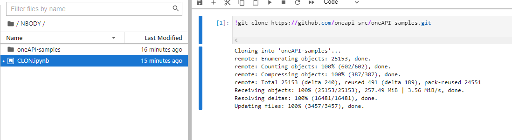

1. Cambiar al directorio del ejemplo `Nbody`  [1 punto]
    - Directorio: `oneAPI-samples/tree/master/DirectProgramming/C++SYCL/N-BodyMethods/Nbody`

    Realizamos el cambio de directorio en el terminal de la siguiente forma: 
    
    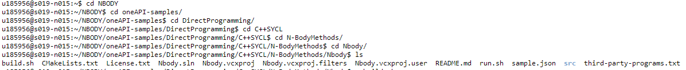
    
2. Explicar brevemente el algoritmo de `Nbody` [3 puntos]

    Para poder observar el código de Nbody entramos a la carpeta src, viendo los archivos GSimulation.cpp y main.cpp podremos ver como funciona el algoritmo.
    
    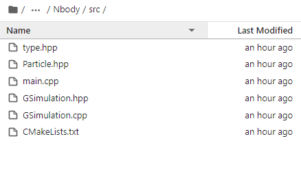
    
    Esta simulación nos muestra un sistema dinámico de partículas, el cual está bajo la influencia de fuerzas, en este caso la gravedad, en el archivo GSimulation.cpp definimos que se realizará la simulación con 16000 partículas, a su vez se definen otros parámetros importantes a la hora de realizar la simulación, este código trabaja con 2 kernel, uno encargado de calcular la aceleración de la partícula, mientras que el otro calcula su nueva posición y velocidad según la aceleración calculada, hay que tener en cuenta que cada una de las 16000 partículas depende de cierta forma de las otras 15999 a la hora de calcular su posición y aceleración. El código de GSimulation es el siguiente:
    
     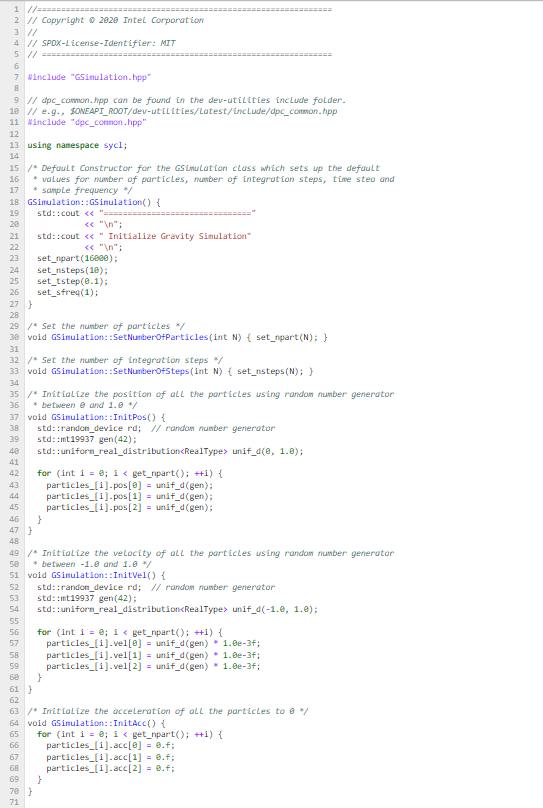 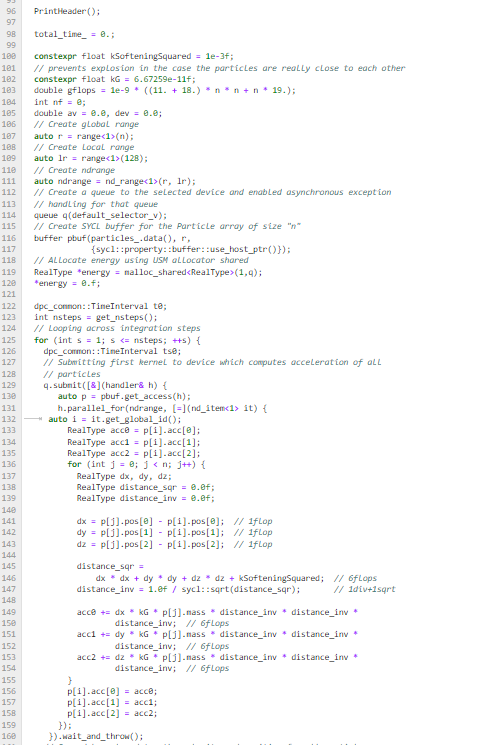 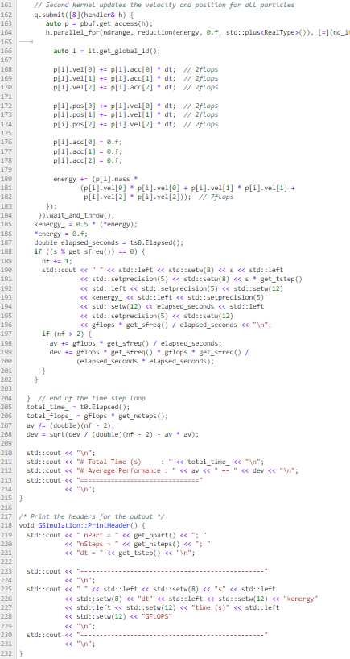

    Al ver el código vemos como la función start es la que se encarga de ejecutar la simulación, a su vez el valor final obtenido de los kernels es el de energy, que luego se presentara como kenergy en la tabla de resultados, el cual representa la energía total de todas las partículas.
    
3. Acceder en modo interactivo a un nodo de cómputo con GPUs (`gen9` o `gen11`) [3 puntos]
    - Compilar y ejecutar `Nbody`
    - Proporcionar screenshot(s) de los resultados
        - Por cada screenshot, añadir una breve descripción
   
   
    Accedemos al nodo gen 11 usando la siguiente línea de comando: qsub  -I  -l nodes=1:gpu:ppn=2 -d ., comprobamos que es un nodo con gpu de la siguiente forma:
    
    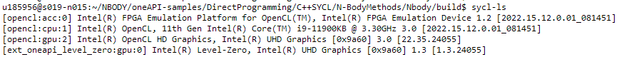
    
    Compilamos y ejecutamos el ejemplo nbody, para esto creamos los siguientes archivos .sh
    
    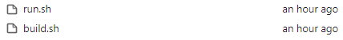 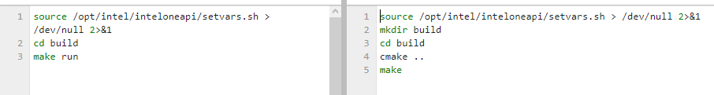
    
    Ahora lo compilamos y ejecutamos el el terminal, obteniendo lo siguiente:
    
    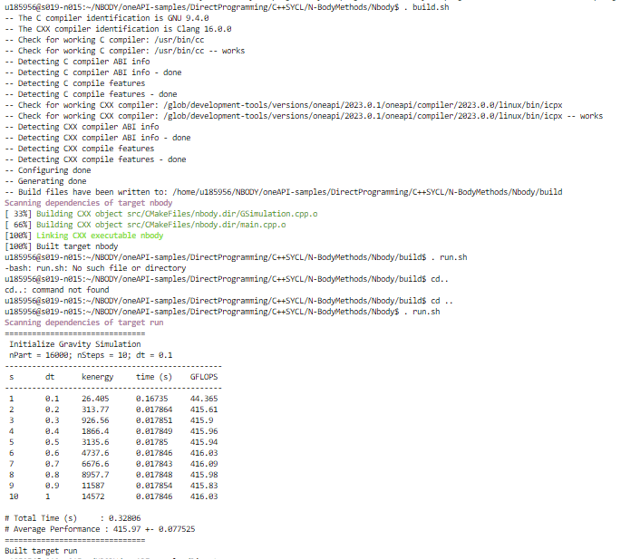
    
    Observamos la compilación usando el comando . build.sh y la ejecución utilizando el comando . run.sh, donde obtenemos como resultado una tabla con lod distintos valores de kenergy y los 10 pasos para las 16000 partículas especificadas en el código.
    
4. Realizar un análisis de _**GPU Hotspots**_ con VTune [8 puntos]
    - Indicar los hotspots del programa
    - Proporcionar screenshot(s) de los resultados
      - Por cada screenshot, añadir una breve descripción
      
    Realizamos el analisis GPU Hotspots del archivo binario nbody encontrado en la carpeta build, lo realizamos de la siguiente forma:
    
    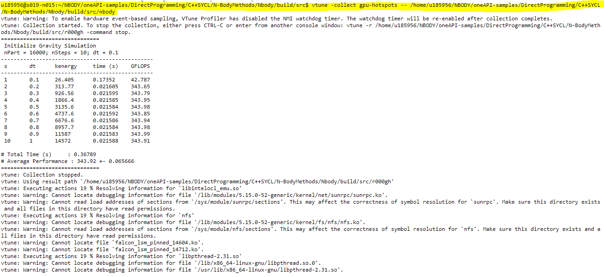 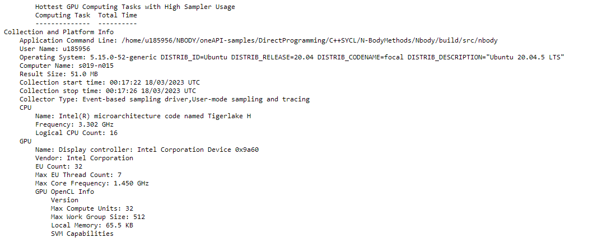
    
    Este proceso crea la carpeta r000gh, la cual la descargaremos por MOBAXTERM para visualizarla en vtune, lo hacemos de la siguiente forma:
    
    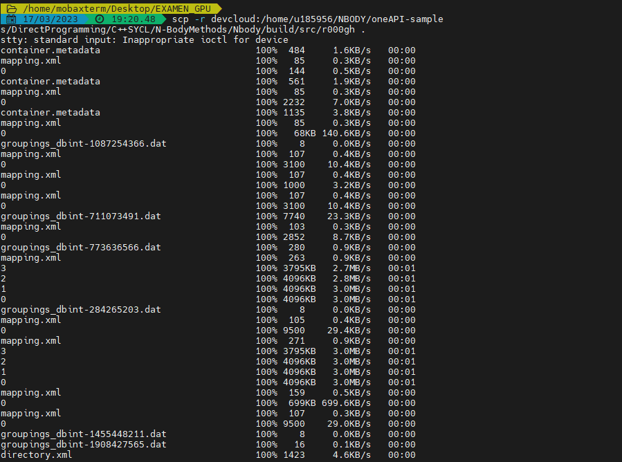
    
    Luego de colocarlo en VTUNE obtenemos la siguiente gráfica:
    
    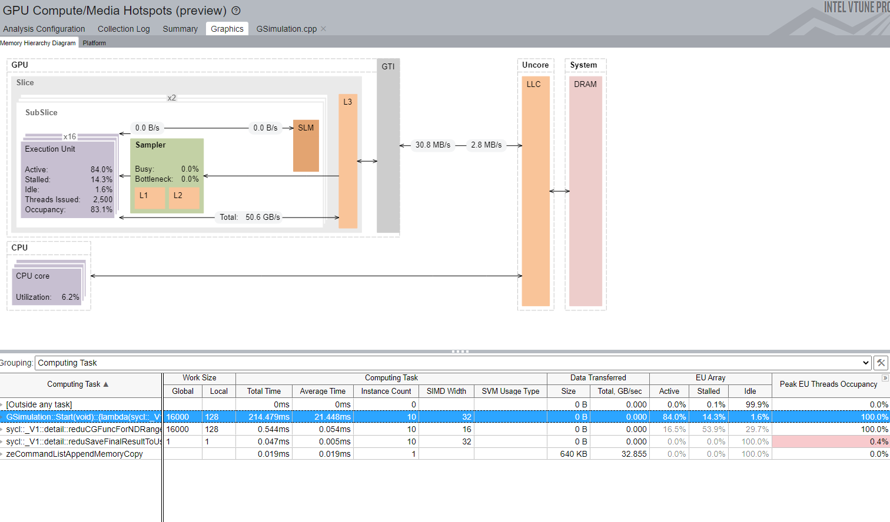
    
    Vemos que la "computer task" mas demandante esta en GSimulation.cpp, por lo que observaremos los hotspots de ese programa, obteniendo el siguiente resultado:
    
    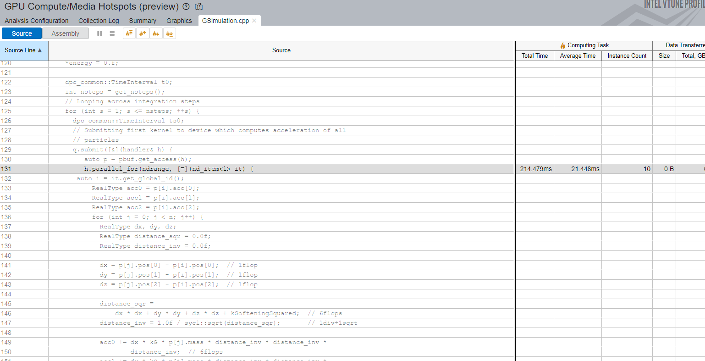
    
    Observamos que hay un hotspot en la paralelización en el primer kernel, este hotspot es el esperado.
    
5. Realizar un análisis _**Roofline**_ con Advisor [4 puntos]
    - Indicar los hotspots del programa
    - Proporcionar screenshot(s) de los resultados
      - Por cada screenshot, añadir una breve descripción
    - Indicar potenciales soluciones para optimizar la ejecución del programa
    
    
    Realizamos el análisis roofline con la siguiente línea de código:
    
    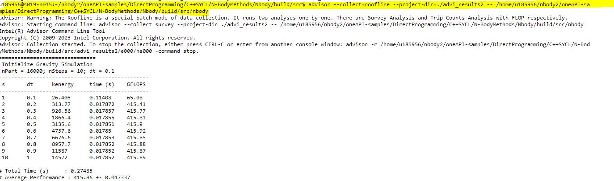
    
    Luego lo descargamos con MobaXterm de la misma forma que hicimos previamente con le hotspot:
    
    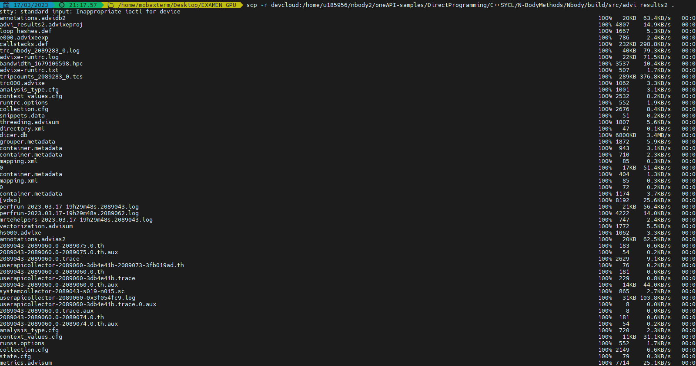
    
    Cabe destacar que también se descargaron los archivos nbody, GSimulation.cpp y GSimulation.hpp
    
    Después de correrlo en el advisor nos muestra lo siguiente:
    
    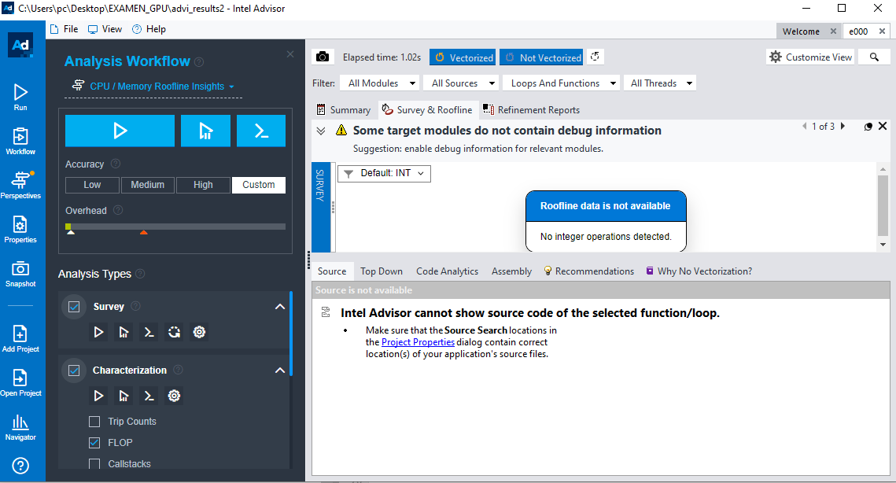
    
    Se muestra un error, donde no presenta ni operaciones de punto flotante ni operaciones de variables de tipo int.
    
    